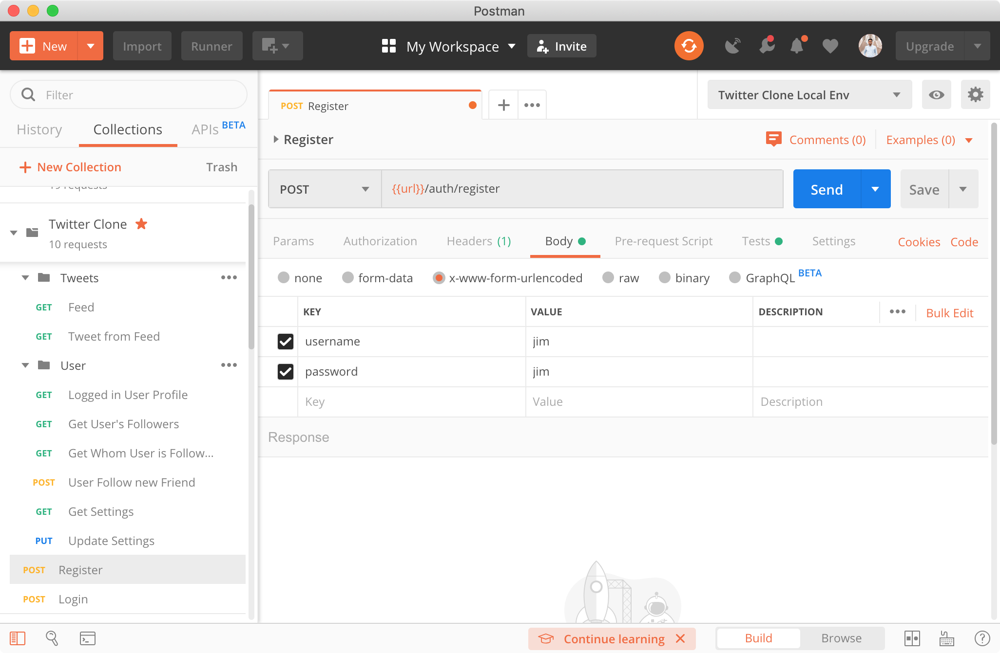

# express-mysql


Code for understanding for creating REST API in Node.js with Express and MySQL.

The article/tutorial can be be read here: https://time2hack.com/2019/09/creating-rest-api-in-node-js-with-express-and-mysql/

You cna run this collection in Postman with following button:

[](https://app.getpostman.com/run-collection/addfc209f1ab0fc6c873)

----




Or Download and import in Postman from here: <a href="./Twitter Clone.postman_collection.json" download>Download</a>

-----

```sql
CREATE DATABASE twitter_clone;

use twitter_clone;

CREATE TABLE users(
  id int NOT NULL AUTO_INCREMENT,
  username varchar(15) NOT NULL,
  password varchar(32) NOT NULL,
  followers int DEFAULT 0,
  following int DEFAULT 0,
  tweets int DEFAULT 0,
  PRIMARY KEY (id)
);

CREATE TABLE following(
  id int NOT NULL AUTO_INCREMENT,
  user1_id int REFERENCES `users` (`id`) ON DELETE CASCADE ON UPDATE CASCADE,
  user2_id int REFERENCES `users` (`id`) ON DELETE CASCADE ON UPDATE CASCADE,
  PRIMARY KEY (id)
);

CREATE TABLE tweets(
  id int NOT NULL AUTO_INCREMENT,
  username varchar(15) NOT NULL,
  user_id int REFERENCES `users` (`id`) ON DELETE CASCADE ON UPDATE CASCADE,
  tweet varchar(140) NOT NULL,
  timestamp TIMESTAMP NOT NULL DEFAULT CURRENT_TIMESTAMP,
  PRIMARY KEY (id)
);

INSERT INTO USERS(username, password) VALUE('pankaj', MD5('pankaj'));

INSERT INTO USERS(username, password) VALUE('tim', MD5('tim'));

INSERT INTO USERS(username, password) VALUE('jim', MD5('jim'));

INSERT INTO TWEETS(username, user_id, tweet) VALUE('pankaj', 1, 'Hello World Again!');

INSERT INTO FOLLOWING(user1_id, user2_id) VALUE(1, 2);
INSERT INTO FOLLOWING(user1_id, user2_id) VALUE(1, 3);
INSERT INTO FOLLOWING(user1_id, user2_id) VALUE(3, 1);

SELECT * FROM tweets;

# Followers

SELECT
USER_INFO.*, username as user1_username
FROM (SELECT 
user1_id, user2_id, username as user2_username
FROM FOLLOWING LEFT JOIN USERS ON user2_id = users.id
WHERE user1_id = 1) as USER_INFO
LEFT JOIN USERS ON user1_id = users.id ;

# Following

SELECT
USER_INFO.*, username as user1_username
FROM (SELECT 
user1_id, user2_id, username as user2_username
FROM FOLLOWING LEFT JOIN USERS ON user2_id = users.id
WHERE user2_id = 1) as USER_INFO
LEFT JOIN USERS ON user1_id = users.id ;
```
